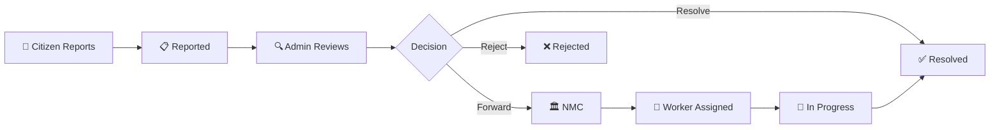

<div align="center">

# 🏙️ CivicFix

### AI-Powered Civic Issue Reporting & Resolution Platform

[](https://reactnative.dev/)
[](https://expo.dev/)
[](https://supabase.com/)
[](https://ultralytics.com/)
[](LICENSE)

*Empowering citizens to report civic issues with AI assistance, enabling municipal authorities to track, assign, and resolve them efficiently through a multi-role workflow.*

---

[Features](#-features) • [Architecture](#-architecture) • [Tech Stack](#-tech-stack) • [Getting Started](#-getting-started) • [User Roles](#-user-roles) • [Screenshots](#-screenshots) • [API Reference](#-api-reference)

</div>

---

## 🎯 Problem Statement

Urban infrastructure issues — potholes, broken streetlights, garbage dumps, sewage overflows — often go unreported or take weeks to reach the right department. Citizens lack a fast, reliable channel to report problems, and municipal bodies struggle with issue tracking, prioritization, and accountability.

**CivicFix bridges this gap** with an AI-powered mobile platform that enables zero-friction reporting and provides municipal authorities with real-time dashboards, automated issue routing, and field worker management.

---

## ✨ Features

### 📸 AI-Powered Issue Reporting
- **YOLOv8 Object Detection** — Point your camera at a civic issue and the AI automatically detects and categorizes it (pothole, garbage, streetlight, etc.)
- **Auto-Categorization** — No manual selection needed; the AI tags the issue type from the camera feed
- **Severity Scoring** — Algorithmic severity estimation based on detection confidence and bounding box analysis
- **GPS Auto-Location** — Automatically captures precise coordinates and reverse-geocodes the address
- **Image Evidence** — Photo upload with Supabase Storage for visual documentation

### 🗺️ Interactive Map View
- **Real-Time Issue Pins** — All reported issues displayed as color-coded markers on the map
- **Severity Color Coding** — Critical (red), High (orange), Medium (yellow), Low (green)
- **Impact Radius Circles** — Visual representation of issue impact proportional to community votes
- **Filter by Severity** — Quick filter chips to isolate critical, high, medium, or low issues
- **Tap-to-View Details** — Tap any pin for full issue information

### 🏆 Community Leaderboard
- **Karma Points System** — Citizens earn points for reporting and community engagement
- **Badge Levels** — Newcomer → Bronze → Silver → Gold → Platinum progression
- **Top Reporter Podium** — Highlights the top 3 contributors with a visual podium
- **Time-Based Filters** — All Time, This Week, and Monthly leaderboard views

### 👤 Guest/Anonymous Reporting
- **No Login Required** — Citizens can report issues immediately without creating an account
- **Frictionless Onboarding** — "Report as Guest" option on the login screen
- **Full Reporting Capability** — Guests can capture photos, tag locations, and submit reports

---

## 🔐 User Roles & Workflow

CivicFix implements a **multi-role issue resolution pipeline**:

```
Citizen/Guest → Admin → NMC (Municipal Corp.) → Field Worker → Resolved
```

### Role Details

| Role | Credentials | Access |
|------|-------------|--------|
| **Citizen** | Email/Password (Supabase Auth) | Report issues, view map, leaderboard, profile |
| **Guest** | No login needed | Report issues only |
| **Admin** | `admin` / `123` | Dashboard analytics, issue management, forward to NMC |
| **NMC** | `nmc` / `123` | Worker assignment, issue tracking, resolution management |

### 🏛️ Admin Dashboard
- **Overview Tab** — 4 stat cards (Total Issues, New Reports, In Review, Resolved), weekly reports bar chart, category breakdown with progress bars, resolution metrics (rate, avg response time, rating), severity distribution
- **Issues Tab** — Scrollable list of all reports with status badges, tap to update status or **Forward to NMC** for resolution
- **Map Tab** — Full map view of all issue pins with admin-specific legend and color coding

### 🏢 NMC Municipal Dashboard
- **Issues Tab** — Forwarded issues with status pipeline (Pending → Assigned → In Progress → Resolved)
- **Workers Tab** — Field worker roster with availability status, zone assignments, and task completion counts
- **Map Tab** — Color-coded pins showing issue resolution progress across the city
- **Worker Assignment** — Select and dispatch available field workers to specific issue locations
- **Resolution Workflow** — Assign Worker → Start Work → Mark Resolved

---

## 🏗 Architecture

```
┌──────────────────────────────────────────────────────────────────┐
│                        Presentation Layer                        │
│  ┌──────────┐ ┌──────────┐ ┌──────────┐ ┌──────────┐           │
│  │ Citizen   │ │  Admin   │ │   NMC    │ │  Worker  │           │
│  │ (5 tabs) │ │(3 tabs)  │ │ (3 tabs) │ │Dashboard │           │
│  └──────────┘ └──────────┘ └──────────┘ └──────────┘           │
└──────────────────────────────────────────────────────────────────┘
                              ↕
┌──────────────────────────────────────────────────────────────────┐
│                      Application Logic Layer                     │
│  ┌─────────────┐ ┌─────────────┐ ┌─────────────┐               │
│  │ AuthContext  │ │ AI Analyzer │ │  Real-time   │              │
│  │ (Multi-role)│ │ (YOLOv8 API)│ │  Listeners   │              │
│  └─────────────┘ └─────────────┘ └─────────────┘               │
└──────────────────────────────────────────────────────────────────┘
                              ↕
┌──────────────────────────────────────────────────────────────────┐
│                          Data Layer                               │
│  ┌────────────────────────────────────────────────────────────┐  │
│  │                     Supabase (BaaS)                        │  │
│  │  ┌──────┐  ┌──────────┐  ┌─────────┐  ┌──────────────┐   │  │
│  │  │ Auth │  │ Postgres │  │ Storage │  │  Realtime     │   │  │
│  │  │      │  │ (issues, │  │ (images)│  │  (live sync)  │   │  │
│  │  │      │  │ profiles)│  │         │  │               │   │  │
│  │  └──────┘  └──────────┘  └─────────┘  └──────────────┘   │  │
│  └────────────────────────────────────────────────────────────┘  │
└──────────────────────────────────────────────────────────────────┘
                              ↕
┌──────────────────────────────────────────────────────────────────┐
│                      External Services                            │
│  ┌──────────────────┐  ┌─────────────────────────────────────┐  │
│  │ Hugging Face API │  │ Google Maps / React Native Maps     │  │
│  │ (YOLOv8 Model)   │  │ (Geocoding, Map Tiles, Markers)    │  │
│  └──────────────────┘  └─────────────────────────────────────┘  │
└──────────────────────────────────────────────────────────────────┘
```

---

## 🛠 Tech Stack

| Layer | Technology | Purpose |
|-------|-----------|---------|
| **Frontend** | React Native + Expo SDK 54 | Cross-platform mobile app |
| **Navigation** | React Navigation 6 | Stack + Bottom Tab navigation |
| **Maps** | react-native-maps | Interactive map with markers & circles |
| **Backend** | Supabase | Auth, Postgres DB, Storage, Realtime |
| **AI/ML** | YOLOv8 (Hugging Face API) | Object detection for issue categorization |
| **Icons** | @expo/vector-icons (Ionicons) | UI iconography |
| **Auth** | Supabase Auth + Expo SecureStore | Token management & session persistence |

---

## 📁 Project Structure

```
CivicFix/
├── App.js                          # Root navigator with role-based routing
├── context/
│   └── AuthContext.js              # Multi-role auth (Citizen, Admin, NMC, Worker, Guest)
├── lib/
│   ├── supabase.js                 # Supabase client configuration
│   └── aiAnalyzer.js               # YOLOv8 Hugging Face integration
├── constants/
│   └── categories.js               # Issue categories, severity colors, status labels
├── components/
│   ├── StatusBadge.js              # Reusable status indicator component
│   ├── CategoryPicker.js           # Issue category selector
│   └── IssueCard.js                # Issue list item card
├── screens/
│   ├── auth/
│   │   ├── OnboardingScreen.js     # Welcome screen with feature highlights
│   │   ├── LoginScreen.js          # Email/password + admin/NMC login
│   │   └── SignupScreen.js         # New citizen registration
│   ├── citizen/
│   │   ├── HomeScreen.js           # Citizen home feed
│   │   ├── ReportIssueScreen.js    # AI-powered issue reporting with camera
│   │   ├── IssueDetailScreen.js    # Full issue details with media
│   │   ├── MapScreen.js            # Interactive map with issue pins
│   │   ├── LeaderboardScreen.js    # Community karma leaderboard
│   │   └── ProfileScreen.js        # User profile and stats
│   ├── admin/
│   │   └── AdminDashboard.js       # Admin panel (Overview, Issues, Map)
│   ├── nmc/
│   │   └── NMCDashboard.js         # NMC panel (Issues, Workers, Map)
│   └── worker/
│       └── WorkerDashboard.js      # Field worker task view
├── supabase/
│   ├── config.toml                 # Supabase local config
│   ├── migrations/                 # Database schema migrations
│   └── seed.sql                    # Seed data
├── web/                            # Web dashboard (HTML/CSS/JS)
│   ├── index.html
│   ├── main.js
│   └── styles.css
├── app.json                        # Expo configuration
├── package.json                    # Dependencies
└── README.md                       # This file
```

---

## 🚀 Getting Started

### Prerequisites

- **Node.js** >= 18.x
- **npm** or **yarn**
- **Expo CLI** — `npm install -g @expo/cli`
- **Expo Go** app (v54.0.6+) on your mobile device

### Installation

```bash
# Clone the repository
git clone https://github.com/9SERG4NT/Kdk_hackathon.git
cd Kdk_hackathon

# Install dependencies
npm install

# Start the development server
npx expo start --tunnel
```

### Environment Setup

1. Create a Supabase project at [supabase.com](https://supabase.com)
2. Copy your project URL and anon key to `lib/supabase.js`
3. Run the migrations in `supabase/migrations/` against your database
4. (Optional) Set up a Hugging Face API token in `lib/aiAnalyzer.js` for YOLOv8

### Quick Test

| Action | Steps |
|--------|-------|
| **Citizen Login** | Sign up with email/password → Report issues, view map |
| **Guest Report** | Tap "Continue as Guest" → Report an issue immediately |
| **Admin Panel** | Login with `admin` / `123` → View analytics, forward issues |
| **NMC Panel** | Login with `nmc` / `123` → Assign workers, resolve issues |

---

## 🗺️ Demo Data

The app comes preloaded with **demo issues across Nagpur** for immediate testing:

| Location | Issue Type | Severity |
|----------|-----------|----------|
| Wardha Road | Pothole | High |
| Ambazari Garden | Garbage Dump | Medium |
| Dharampeth | Street Light | High |
| Sitabuldi Main Road | Water Pipe Burst | Critical |
| Sadar | Broken Footpath | Medium |
| Hislop College (Civil Lines) | Open Manhole | Critical |
| Hingna Road | Fallen Tree | High |
| Futala Lake | Illegal Dumping | High |
| Manewada | Cracked Road | Medium |
| Civil Lines | Leaking Hydrant | Low |

---

## 📊 Database Schema

### `road_issues` Table

| Column | Type | Description |
|--------|------|-------------|
| `id` | UUID | Primary key |
| `title` | TEXT | Issue title |
| `description` | TEXT | Detailed description |
| `category` | TEXT | Issue category (pothole, garbage, etc.) |
| `severity` | TEXT | critical, high, medium, low |
| `status` | TEXT | reported, in_review, forwarded_nmc, worker_assigned, in_progress, resolved, rejected |
| `latitude` | FLOAT | GPS latitude |
| `longitude` | FLOAT | GPS longitude |
| `address` | TEXT | Reverse-geocoded address |
| `image_url` | TEXT | Supabase Storage URL |
| `reporter_id` | UUID | Foreign key to profiles |
| `reporter_name` | TEXT | Display name |
| `vote_count` | INT | Community upvotes |
| `created_at` | TIMESTAMP | Report timestamp |

### `profiles` Table

| Column | Type | Description |
|--------|------|-------------|
| `id` | UUID | Primary key (matches auth.users) |
| `full_name` | TEXT | User display name |
| `role` | TEXT | citizen, admin, nmc, worker |
| `karma_points` | INT | Community contribution score |
| `total_reports` | INT | Number of issues reported |
| `badge_level` | TEXT | newcomer, bronze, silver, gold, platinum |

---

## 🔄 Issue Resolution Pipeline



---

## 🤝 Team

**Team KDK** — Built for the Hackathon

---

## 📄 License

This project is licensed under the MIT License — see the [LICENSE](LICENSE) file for details.

---

<div align="center">

**Built with ❤️ using React Native, Supabase & YOLOv8**

*CivicFix — Fixing Cities, One Report at a Time*

</div>
